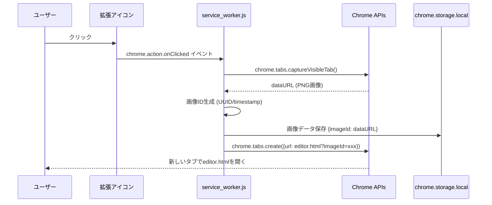
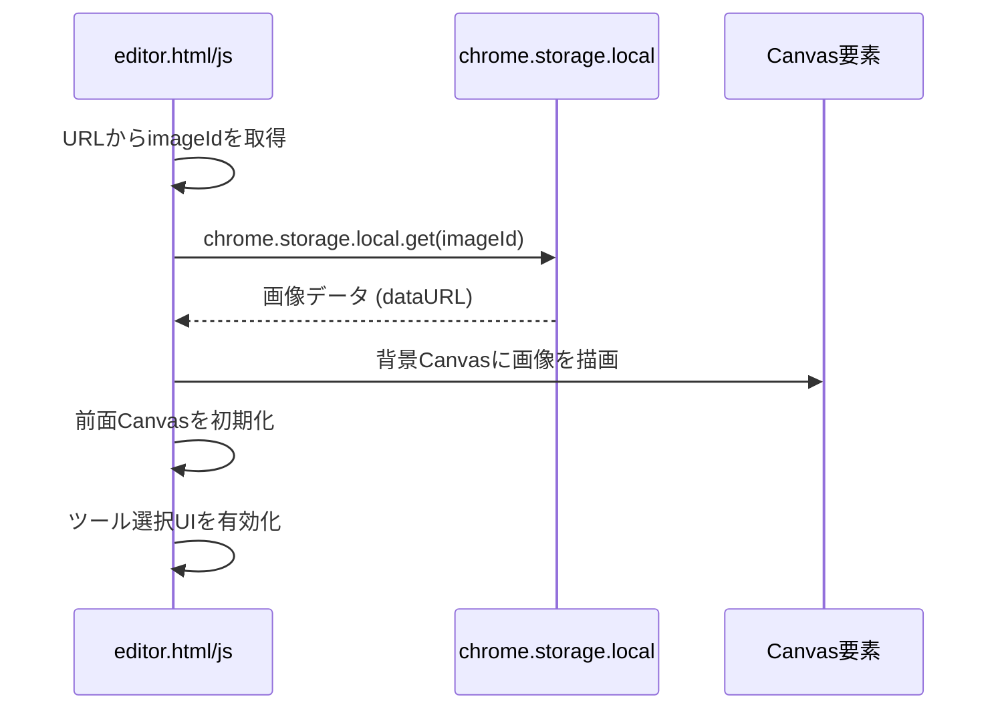
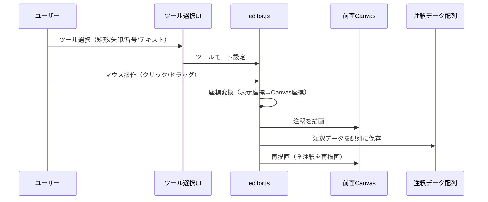
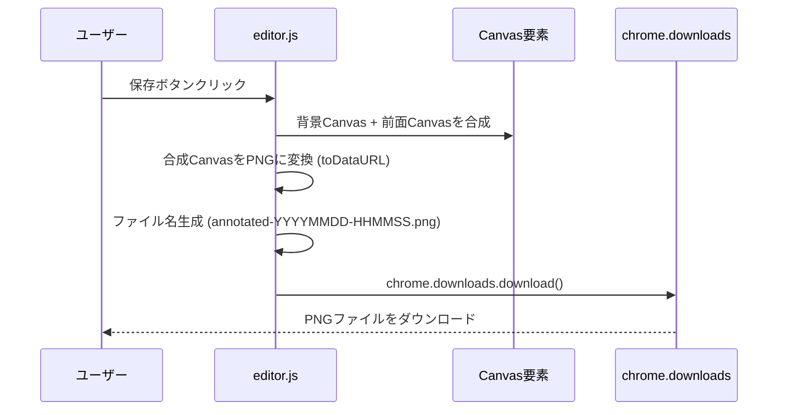

# アーキテクチャ設計書

## システム概要

Chrome拡張（Manifest V3）として実装される、スクリーンショット注釈エディタのアーキテクチャ設計。

## コンポーネント構成

```
┌─────────────────────────────────────────────────────────┐
│                    Chrome Extension                      │
├─────────────────────────────────────────────────────────┤
│                                                           │
│  ┌──────────────────┐         ┌──────────────────┐     │
│  │ service_worker.js│         │   editor.html     │     │
│  │                  │         │   editor.css     │     │
│  │ - スクショ取得   │────────▶│   editor.js      │     │
│  │ - データ保存     │         │                  │     │
│  │ - タブ起動       │         │ - Canvas描画     │     │
│  └──────────────────┘         │ - 注釈ツール     │     │
│           │                   │ - 保存処理       │     │
│           │                   └──────────────────┘     │
│           │                           │                 │
│           └───────────┬───────────────┘                 │
│                       │                                 │
│              ┌────────▼────────┐                        │
│              │ chrome.storage   │                        │
│              │     .local       │                        │
│              └──────────────────┘                        │
│                                                           │
└─────────────────────────────────────────────────────────┘
```

## データフロー詳細

### 1. スクリーンショット取得フロー



### 2. 編集画面読み込みフロー



### 3. 注釈描画フロー



### 4. 保存フロー



## Canvas実装詳細

### 2層Canvas構造

```
┌─────────────────────────────────────┐
│         editor.html                 │
│                                     │
│  ┌───────────────────────────────┐ │
│  │   前面Canvas (annotation)     │ │ ← 注釈を描画（動的）
│  │   - 矩形、矢印、番号、テキスト │ │
│  └───────────────────────────────┘ │
│  ┌───────────────────────────────┐ │
│  │   背景Canvas (background)     │ │ ← スクショ画像（固定）
│  │   - スクリーンショット画像     │ │
│  └───────────────────────────────┘ │
│                                     │
└─────────────────────────────────────┘
```

### 座標変換ロジック

```javascript
// 表示サイズとCanvasサイズの比率を計算
const scaleX = canvas.width / canvas.offsetWidth;
const scaleY = canvas.height / canvas.offsetHeight;

// マウス座標をCanvas座標に変換
function screenToCanvas(x, y) {
  const rect = canvas.getBoundingClientRect();
  return {
    x: (x - rect.left) * scaleX,
    y: (y - rect.top) * scaleY
  };
}
```

### 注釈データ構造

```javascript
// 注釈データの配列
const annotations = [
  {
    type: 'rectangle',
    x: 100,
    y: 100,
    width: 200,
    height: 150,
    color: '#ff3b30',
    lineWidth: 2
  },
  {
    type: 'arrow',
    startX: 50,
    startY: 50,
    endX: 200,
    endY: 200,
    color: '#ff3b30',
    lineWidth: 2
  },
  {
    type: 'number',
    x: 150,
    y: 150,
    number: 1,
    color: '#ff3b30'
  },
  {
    type: 'text',
    x: 250,
    y: 250,
    text: '説明テキスト',
    fontSize: 16,
    color: '#ff3b30'
  }
];
```

## ファイル構成と責務

### service_worker.js
- **責務**: スクリーンショット取得、データ保存、タブ起動
- **主要関数**:
  - `captureScreenshot()`: スクショ取得
  - `saveImageToStorage()`: storage.localに保存
  - `openEditor()`: editor.htmlを新しいタブで開く

### editor.html
- **責務**: 編集画面のHTML構造
- **主要要素**:
  - ツール選択ボタン群
  - 保存ボタン
  - 2つのCanvas要素（背景・前面）

### editor.css
- **責務**: 編集画面のスタイリング
- **主要スタイル**:
  - ツールバーのレイアウト
  - Canvasの配置とサイズ調整

### editor.js
- **責務**: 注釈描画、ツール操作、保存処理
- **主要クラス/関数**:
  - `Editor`: メインエディタクラス
  - `ToolManager`: ツール管理
  - `CanvasManager`: Canvas操作
  - `AnnotationRenderer`: 注釈描画
  - `saveAsPNG()`: PNG保存処理

## エラーハンドリング

### 想定されるエラーケース

1. **スクショ取得失敗**
   - 権限不足
   - タブが読み込まれていない
   - 対応: エラーメッセージを表示

2. **画像データ読み込み失敗**
   - storage.localにデータがない
   - データが破損
   - 対応: editor画面にエラーメッセージ表示

3. **保存失敗**
   - ダウンロード権限不足
   - ディスク容量不足
   - 対応: エラーメッセージを表示

## パフォーマンス考慮事項

- **Canvas再描画**: 注釈追加時は全注釈を再描画（シンプルな実装）
- **画像サイズ**: 大きなスクショの場合、storage.localの容量制限に注意
- **メモリ管理**: 使用済み画像データのクリーンアップ（任意）

## セキュリティ考慮事項

- 外部通信なし（完全ローカル完結）
- ユーザーデータはstorage.localにのみ保存
- 悪意のあるコンテンツの注入を防ぐ（入力値のサニタイズ）

